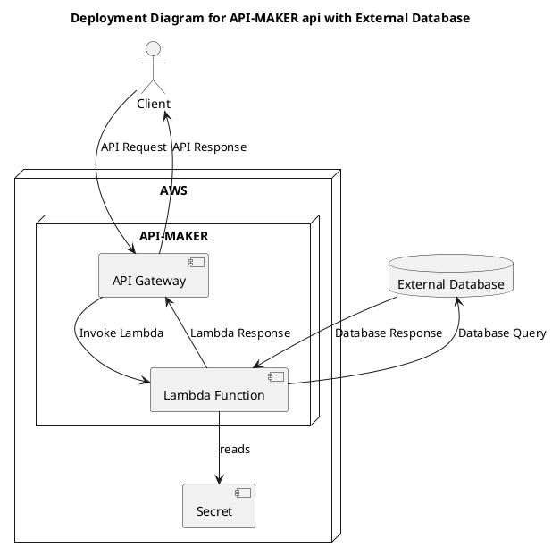
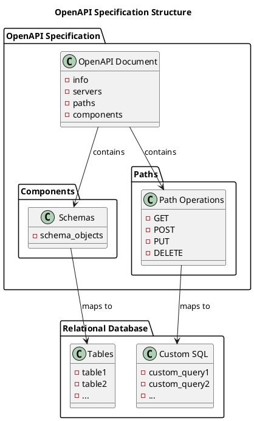

# API-MAKER

Welcome to API-Maker, an open-source tool designed for rapidly building and exposing relational database resource as RESTful services.  The project's primary objective is to offer a solution that requires minimal coding effort to query and manipulate data stored in relational databases.

Database resources that API-MAKER can expose as services can be either tables or custom SQL.

With tables API-MAKER provides services to support record management or CRUD operations.  Additionally with table resourses API-MAKER provides a rich record selection API that reduces the need to build custom functions.

Custom SQL operations can also be exposed.

In the following sections we will provide a brief overview of the following API-MAKER features;

* [Build an API](#Build an API in Five Minutes) - this section provides an abbreviated example of building an API.
* [Exploring the API deployment](#What API-Maker Deploys) - Briefly looks at resulting the API-MAKER deployment.
* **Exploring the Services** - This section delves into the API services that that was built, covered are basic operations and the enhanced record selection capabilities provided.
* **Using Metadata Parameters** - These parameters allow requesting application to customize the results returned from the services.
* **Managing Concurrency** - This section illustrates how API-MAKER handles currency between application clients.
* **Object and List Properties** - API-MAKER can return objects that have objects or list of objects as properties.  This section demonstrates how to configure such properties.

The examples presented here are accessing data in a Chinook database.  What is presented in the example is an subset of a complete working example that can be found in the examples.

## Build an API in Five Minutes

There are three steps to building an API-MAKER api;

1. Define the resources to be exposed in an OpenAPI document.
1. Create a secret containing the connection parameters to access the database.
1. Deploy the API-Maker as part of a IAC resource to AWS.

This section provides a quick overview of building an minimal API using API-MAKER.  The examples presented here a accessing data in a Chinook database.  What is presented is an subset of a complete working example that can be found in the examples.

**Define Schema Objects**

The first step is to define the database table as a component schema object in the API specification. This specfication uses the OpenAPI specfication.

In the abbreviated specification we are only building services albums and artists.

```yaml
# filename: chinook_postgres.yaml
openapi: 3.1.0
info:
  title: Chinook RestAPI
  version: 1.0.0
components:
  schemas:
    album:
      type: object
      x-am-database: chinook
      properties:
        album_id:
          type: integer
          x-am-primary-key: auto
        title:
          type: string
          maxLength: 160
        artist_id:
          type: integer
      required:
        - album_id
        - title
        - artist_id
    artist:
      type: object
      x-am-database: chinook
      properties:
        artist_id:
          type: integer
          x-am-primary-key: auto
        name:
          type: string
          maxLength: 120
      required:
        - artist_id
```

The above is standard OpenAPI specification with additional custom attributes.  API-MAKER always prefixes custom attributes it uses with 'x-am-'.

In this example the following API-MAKER attributes have been added;

* x-am-database - This indicates what database should be accessed for the built services.
* x-am-primary-key - This attribute can be attached to one of the object properties to indicate that property is the primary key for the component object.  The value of this property is the key generation strategy to use for record creation.

In this example table names, albums and artists, is same as the component object names and in turn in the API path operations.  API-MAKER provides additional custom attributes that allow explicit naming of the table.

> TODO: Link to custom attribute documentation

**Define the Database Access Secret**

For the second step you will need to supply API-MAKER with connection parameters for access to databases.

With API-MAKER the connection parameters needed to access the backend database is obtained using a AWS secretsmanager secret.  This secret should be a JSON string defining the connection parameters needed. The following script creates a secret for accessing the Chinook database running on Postgres.

```python
import boto3

# Create a Secrets Manager client
client = boto3.client("secretsmanager")

client.create_secret(
  Name="postgres/chinook",
  SecretString=json.dumps(
    {
        "engine": "postgres",
        "dbname": "chinook",
        "username": "chinook_user",
        "password": "chinook_password",
        "host": "postgres_db",
    }
  )
)

```

**Deploy the API**

The final step is to deploy the API.  In the example the deployment is made using Pulumi.

```python
#filename: __main.py__
from api_maker.iac.pulumi.api_maker import APIMaker

api_maker = APIMaker(
    "chinook-postgres",
    props={
        # this references the OpenAPI file created
        # in the first step
        "api_spec": "./chinook_api.yaml",

        # This parameter maps databases referenced in
        # the api_spec to secret names
        "secrets": json.dumps({"chinook": "postgres/chinook"}),
    },
)
```

## What API-Maker Deploys

Once the API-Maker deployment is complete



## Using API-Maker Services

API-Maker provides a robust API that allows clients flexibility in selecting and modifying records. This section explores the API services offered by API-Maker.

There are four sections that cover the available services:
1. **Basic Operations**: CRUD operations on single records.
2. **Enhanced Record Selection**: Advanced querying capabilities.
3. **Metadata Parameters**: Tailoring the content of responses.

Most examples will use an abbreviated API specification, but some will reference the complete Chinook API specification.

### Basic Operations

API-Maker supports basic CRUD services using RESTful HTTP methods. Data passed via requests and responses is in JSON format.

Successful operations return the status via response headers. The response body contains an array of the selected objects. For POST, PUT, and DELETE operations, the body contains the modified or deleted records.

The operation paths are as follows:

```
# for POST
/{entity}
# for GET, PUT and DELETE
/{entity}/{id}
```

Where:
- **entity**: The schema component object name from the API specification (e.g., album, artist).
- **id**: The primary key of the selected record.

### Enhanced Record Selection

In addition to basic CRUD operations, API-Maker offers enhanced record selection using query strings. This feature allows selection of multiple records and does not apply to create operations. The path for these services is:

```
# for GET, PUT and DELETE
/{entity}
```

Records are selected using query string parameters, where the name can be any property defined in the component schema object.

Examples for the Chinook database:

```
# get an artist, same as /artist/3
GET /artist?artist_id=3

# get an album, same as /album/5
GET /album/album_id=5

# get the albums by an artist
GET /album?artist_id=3

# get the invoices where the billing country is USA and the total was $3.96
GET /invoice?total=3.96&billing_country=USA
```

**Relational Expressions**

Relational operands can be prefixed to the value of a parameter. These operands allow selecting records based on criteria rather than exact matches. The available operands are:

- `lt` (less than)
- `le` (less than or equal to)
- `eq` (equal to)
- `ne` (not equal to)
- `ge` (greater than or equal to)
- `gt` (greater than)
- `in` (in a list of values)
- `between` (between a range of values)
- `not-between` (not between a range of values)

Examples:

```
# read albums with an album_id of less than 100
GET /album?album_id=lt::100

# read invoices that total either $3.96 or $5.94
GET /invoice?total=in::5.94,3.96

# read invoices that are between $3.00 and $6.00
GET /invoice?total=between::3,6
```

### Using Metadata Parameters

Requests can include metadata parameters in query strings to provide additional instructions. Metadata parameters are prefixed with double underscores `__`.

**__properties**

The `__properties` metadata parameter restricts the properties of objects returned by API-Maker. By default, API-Maker returns all properties of an object, excluding object and array properties. These properties must be explicitly selected using this parameter.

The format of the parameter value is a space-delimited list of regular expressions. Only properties matching any of the expressions are included in the result set.

When this parameter is omitted, API-Maker uses the expression `.*` to select all non-object or non-array properties. When included, API-Maker does not include any properties by default, and all properties must be explicitly selected.

For example, to select specific properties of the Chinook invoice, you could use the following request:

```yaml
GET {endpoint}/invoice?__properties=invoice_id%20billing_.*%20price
```

With this expression, the `invoice_id`, `price`, and all billing address properties will be included in the result set objects.

When selecting properties from object or array objects, the property selection regular expression must be prefixed with the property name, delimited by a colon (`:`). An example of selecting the `customer` property in an invoice would be:

```yaml
GET {endpoint}/invoice?__properties=.*%20customer:.*
```

In this example, there are two regular expressions: `.*` and `customer:.*`. The first expression, `.*`, selects all the invoice's non-object or array fields. The second expression selects all the properties of the `customer` object.

To select both the `customer` and `invoice_line_items` properties in an invoice, you would use:

```yaml
GET {endpoint}/invoice?__properties=.*%20customer:.*%20invoice_line_items:.*
```

> Nesting of property selectors for objects and arrays is not supported. For example, in the Chinook invoice, invoices have `invoice_line_items`, and `invoice_line_items` then have a `track`. The expression `invoice_line_items:track:.*` logically sets the `track` property on the `invoice_line_items` in each invoice. This is not supported at this time.

**__count**

When present, returns the count of the records selected instead of the list of records. This parameter applies only to `GET` requests. The result is a JSON object with a single attribute `count`.

Example:

```
GET {endpoint}/invoices?customer_id=5&__count
```

Response:

```json
{"count": 7}
```

**__sort**

Specifies the order of records returned in the response. This parameter applies only to `GET` requests. The sort order is specified with a comma-delimited list of property names. Optionally, append `:asc` or `:desc` to the property name to specify ascending or descending order, respectively. The default is ascending.

Example:

```
GET {endpoint}/invoice?__sort=invoice_date:desc,total
```

Sorting can also be applied to properties in object fields using a dot `.` delimiter.

Example:

```
GET {endpoint}/invoice?__sort=customer.support_rep_id
```

> Sorting on properties of array properties is not supported.

**__offset**

Skips records before beginning the response result set. This parameter applies only to `GET` requests. The value must be a positive integer. If the offset is greater than the total records selected, an empty result set is returned.

Example:

```
GET {endpoint}/invoice?__sort=invoice_id&__offset=50
```

**__limit**

Limits the number of records returned. This parameter applies only to `GET` requests. The value must be a positive integer. The response result set maximum length will be the specified limit.

Example:

```
GET {endpoint}/invoice?__sort=invoice_id&__limit=20
```

# Developing

As illustrated in the example there are three main components to implementing an API using API-Maker;

* **Build the API Specification** First is the development of the API specification for the application.  The focus will be on mapping SQL tables along with any custom SQL into the OpenAPI specification.

* **Configuration** Then we will look at how API-Maker accesses databases the application references, and how to setup the configuration needed for making connections.

* **Deployment** Finally we will look at the deployment and how to integrate the resulting provisioned infrastructure the cloud environment.

## Building an API Definition

With API-Maker, development is focused on creating an application API specification using the OpenAPI Specification. API-Maker uses this specification to configure the REST API gateway and in the Lambda function that's provides the implementation of the services.

The API implementation with API-Maker is driven by data sources, with the database resources of the application guiding the API design. Database resources can be exposed in an API in two primary ways:

1. **Table Integration**:
   When integrating with a table resource, API-Maker generates services to support CRUD (Create, Read, Update, Delete) operations, along with advanced querying capabilities. This integration is accomplished by defining objects in the component schema section of the API specification.

2. **Custom SQL Integration**:
   While table integration covers most record management needs, relational databases (RDBMs) offer additional functionality that may require custom SQL. API-Maker enables the specification of custom SQL for individual services by defining path operations in the application's OpenAPI specification.

By focusing on the OpenAPI Specification and leveraging API-Maker's features, developers can efficiently build robust APIs that interact with relational databases, reducing the need for extensive custom service development.




### Table Integration

#### API-Maker Integration Guidelines

API-Maker integrates component schema objects with database tables using the following guidelines:

- **Schema Object Naming**: The name of the schema object is used as both the operation path for the built services and the database table name.
- **Database Specification**: A database name must be specified to indicate where the table is located. An application API can span multiple databases.
- **Property Mapping**: Object properties are mapped to table columns. In addition to data types, properties can indicate primary keys and support concurrency management.
- **Defining Object and Array Properties**: Schema objects can have properties that are either objects or arrays or objects.  Some additional configuration is needed to enable this capability.

Since most schema object definitions involve a straightforward mapping between database table columns and schema object properties,

> API-Maker provides [tooling](#generating-openapi -schemas) to build an initial starting point API specification. This specification should be considered a starting point.

> **Note**: The gateway API has limitations on the number of operation paths (routes) allowed in a single API. As of this writing, the limit is 300 routes (extensions are available). Each schema object definition results in seven operation paths or routes, so the effective limit per API is approximately 40 schema objects.

#### Schema Object Naming

The name of the schema object by default is always used as the API path and by default the table name.  If needed name of the table can be changed using the 'x-am-table-name' attribute.

#### Database Specification

At a minimum API-Maker requires that a database be specified using an 'x-am-database' attribute.  Only schema objects with this attribute will have services built.  This attribute is used to obtain the AWS secret that contains the engine type (Postgres, Oracle or MySQL) and the connection configuration.

#### Property Mapping

API-Maker leverages the property types from the schema object to generate SQL and convert query result sets into JSON responses. The set of types in OpenAPI is simpler compared to the larger set of database types.

For each table column exposed in the API, a corresponding property must be defined in the properties section of the schema object. These property definitions map database column types to their corresponding OpenAPI schema type.

> It is also a good time and a good practice to include descriptions and examples for the properties.

Below is an illustration of how different PostgreSQL, Oracle, and MySQL types are mapped into OpenAPI types:


| PostgreSQL Type                     | Oracle Type               | MySQL Type                    | OpenAPI Type            | Description |
|-------------------------------------|---------------------------|-------------------------------|-------------------------|-------------|
| `character varying`, `varchar`      | `VARCHAR2`, `VARCHAR`     | `VARCHAR`, `CHAR`, `TEXT`     | `string`                | Variable-length character string |
| `character`, `char`                 | `CHAR`                    | `CHAR`                        | `string`                | Fixed-length character string |
| `text`                              | `CLOB`                    | `TEXT`, `LONGTEXT`            | `string`                | Variable-length text |
| `integer`, `bigint`, `smallint`     | `NUMBER`, `INTEGER`       | `INT`, `BIGINT`, `SMALLINT`   | `integer`               | Integer number |
| `numeric`, `real`, `double precision` | `NUMBER`, `FLOAT`         | `DECIMAL`, `FLOAT`, `DOUBLE`  | `number`                | Floating-point number |
| `boolean`                           | `NUMBER` (1 or 0)         | `TINYINT(1)`                  | `boolean`               | Boolean value (true/false) |
| `date`                              | `DATE`                    | `DATE`                        | `string`, `format: date` | Date (ISO 8601 format) |
| `timestamp without time zone`       | `TIMESTAMP`               | `TIMESTAMP`                   | `string`, `format: date-time` | Timestamp without time zone (ISO 8601 format) |
| `timestamp with time zone`          | `TIMESTAMP WITH TIME ZONE`| `TIMESTAMP`                   | `string`, `format: date-time` | Timestamp with time zone (ISO 8601 format) |
| `uuid`                              | `RAW`                     | `CHAR(36)`                    | `string`, `format: uuid` | Universally unique identifier (UUID) |


##### Example Conversion

Given a PostgreSQL table with the following definition:

```sql
CREATE TABLE public.example (
    id serial PRIMARY KEY,
    name varchar(255) NOT NULL,
    description text,
    created_at timestamp with time zone DEFAULT current_timestamp
);
```

The corresponding OpenAPI schema object would be:

```yaml
components:
  schemas:
    example:
      type: object
      properties:
        id:
          type: integer
          x-am-primary-key: auto
          description: Unique identifier for the example.
          example: 1
        name:
          type: string
          maxLength: 255
          description: Name of the example.
          example: "Example Name"
        description:
          type: string
          description: Description of the example.
          example: "This is an example description."
        created_at:
          type: string
          format: date-time
          description: Timestamp when the example was created.
          example: "2021-10-05T14:48:00.000Z"
      required:
        - id
        - name
```


#### Object and Array Properties

API-Maker supports returning objects that can have properties as objects or arrays of objects. From a relational database perspective, an object property represents a one-to-one relationship, while an array of objects represents a one-to-many relationship.

Additional configuration in the API specification document can incorporate these types of properties into service result sets. The schema object types for these properties must refer to the same database.

By default, these properties are not included in the result set. They must be explicitly selected in the request using the `__properties` metadata parameter. This allows for the specification of circular properties in the application API. For example, in the Chinook API, an invoice has a customer object property, and a customer, in turn, has an array of invoices property. In this case, services returning invoices can include the customer as a property, but that object will not include the invoices associated with the customer. Similarly, when selecting customers, the invoices associated with the customer can be included, but those invoices cannot contain a customer property.

#### Object Properties

In OpenAPI specifications, object properties typically use a `$ref` attribute to reference the component schema object for the property. When the referenced schema object is part of the same database, API-Maker can automatically populate that property with additional configuration. Specifically, the keys that define the relationship must be identified. The following attributes allow configuring object properties:

* **x-am-parent-property**: Identifies the schema object property containing the key used to select the referenced property value. This attribute is required for object properties.

* **x-am-child-property**: Identifies the property in the referenced schema object to select on. This attribute is optional and defaults to the primary key if omitted. Normally, the parent property key references the primary key, but this attribute can be used if that is not the case.

Here's an example of the customer field from the Chinook invoice schema object:

```yaml
customer_id:
  type: integer
customer:
  $ref: '#/components/schemas/customer'
  x-am-parent-property: customer_id
  description: Customer associated with the invoice.
```

Note how the `x-am-parent-property` identifies the `customer_id` property to use as the key value for selecting the customer.

#### Array of Object Properties

Array properties allow the inclusion of lists of related records representing one-to-many relations within the database. Most of the setup for these properties uses standard OpenAPI conventions. Like object properties, these properties must reference a schema object accessing the same database.

The same additional attributes for defining the relationship as object properties are used:

* **x-am-parent-property**: Identifies the schema object property containing the key used to select the referenced property value. This attribute is optional and defaults to the primary key property.

* **x-am-child-property**: Required attribute that identifies the property in the referenced schema object to select on.

The following illustrates the specification of an `invoice_line_items` property in the invoice schema object. In this example, the `invoice_line` schema object has a property `invoice_id` (x-am-child-property). API-Maker will use the invoice primary key property `invoice_id` to select `invoice_line` records with the matching `invoice_id`.

```yaml
invoice_line_items:
  type: array
  items:
    $ref: '#/components/schemas/invoice_line'
    x-am-child-property: invoice_id
  description: List of invoice_line items associated with this invoice.
```

#### Handling Primary Keys

Within the schema component, a property can be designated as the primary key.   API-Maker offers support for multiple primary key generation strategies.


> Schema objects with multiple primary keys is not currently supported.

A property can be specified as a primary key by adding the 'x-am-primary-key' attribute to the property.  In the value the key generation strategy must be definied it can be any of;

| Value    | Description |
|----------|-------------|
| manual   | The responsibility for providing the key rests with the requesting application. |
| guid     | The database guid generator is usted to  generate the key. |
|auto      | The database table automatically generates the key.
| sequence | Employed in databases like Oracle, where a sequence object serve as the source of keys. |

Here is an example of the primary key for the invoice schema object;

```
    invoice:
      type: object
      properties:
        invoice_id:
          type: integer
          x-am-primary-key: auto
          description: Unique identifier for the invoice.
          example: 1
```

If the key generation strategy is 'sequence' the the 'x-am-sequence-name' attribute must also be defined.

#### Concurrency Management

Optionally, a property within the schema component can be identified as a concurrency control property.  This property is utilized to prevent clients from overriding mutations to objects made by other clients.

When a schema object includes a concurrency control property the following occurs;

* API-Maker manages the value of the property, clients may not change the value.
* For each mutation of the object the value of the property is changed.
* Clients making mutations to objects must provide both the key and the control property.  If the control property does not match the request will fail.

A concurrency control property is set by adding the 'x-am-concurrency-control' attribute to the schema object definition.  The value must be the name of either a string or integer property of the schema object. API-Maker applies the following strategies depending on the property type and format specified for the control property:

| Property Type | Property Format | Column Type | Description |
|---------------|-----------------|-------------|-------------|
| string        | date-time       | timestamp   | Timestamp: API-Maker inserts the current time in the control field, and applications must provide that timestamp. |
| string        |                 |string       | Uses database UUID function in the control value. |
| interger      |                 | integer     |  When created the value is set to one.  Incremented by one on subsequent updates |

Here is an example of using a timestamp as a control object;

```yaml
    invoice:
      type: object
      x-am-database: chinook
      x-am-concurrency-control: last_updated
      properties:
        invoice_id:
          type: integer
          x-am-primary-key: auto
          description: Unique identifier for the invoice.
          example: 1
        last_updated:
          type: string
          format: date-time
```

### Custom SQL Integration

Integrating custom SQL into your application is achieved by defining path operations within the application's OpenAPI specification. When setting up a path operation to invoke custom SQL, you need to define the following:

- **Inputs**: Request parameters that are used to parameterize the custom SQL.
- **SQL to Execute**: The actual SQL query to be executed.
- **Output Response Structure**: The structure of the returned results.

#### Defining Path Operations in the OpenAPI Specification

In the OpenAPI specification, path operations correspond to specific HTTP methods (e.g., `GET`, `POST`, `PUT`, `DELETE`) that define how your API interacts with resources. Each path operation is associated with a specific path (URL) and method, and it specifies the behavior of the API when that path and method are invoked.

For example:
- **GET** operations typically retrieve data.
- **POST** operations create new resources.
- **PUT** operations update existing resources.
- **DELETE** operations remove resources.

In the context of custom SQL integration, you define the path operation with a method (e.g., `GET`, `POST`) in the OpenAPI specification, along with the necessary input parameters, the SQL query to execute, and the expected response format.

#### Deployment and Path Operation Precedence

During deployment, API-Maker builds an OpenAPI specification document that configures the AWS API Gateway. This document combines path operations explicitly defined in the API specification with those needed to support the record management functions associated with any component schema objects.

When combining these two sets of path operations, API-Maker gives precedence to path operations with custom SQL over the default component schema record management functions. This feature allows you to explicitly override API-Maker's default behavior. However, it can also become a potential 'gotcha' if not managed carefully, as custom path operations may inadvertently override essential default operations.

#### Request Inputs

Request inputs can be declared either in the path operation's parameters or in the request body sections of the OpenAPI definition. These inputs are used to parameterize the custom SQL.

- **Path Operation Parameters**: Parameters are generally used for record selection. API-Maker often uses these parameters to filter or identify specific records within the database that match the criteria specified in the custom SQL.

- **Request Body**: The request body is typically used to provide data for storage or updates, and it only applies to `PUT` and `POST` operations. These operations involve creating new records or updating existing ones, and the data to be stored or updated is passed through the request body.

In API-Maker, the names of the inputs defined in the path operation's parameters or request body are used to match placeholders in the custom SQL query. Placeholders in the SQL query are denoted by a colon (`:`) followed by the input name. For example, if you define an input named `user_id`, you would reference this in your custom SQL as `:user_id`. This ensures that the appropriate values are substituted into the SQL query when the API is called.

While API-Maker is designed to obtain parameters from either the path operation parameters or the request body, the convention is to use path operation parameters for selecting records and the request body for storing or updating data. This separation ensures that the custom SQL receives the appropriate inputs depending on the type of operation being performed.

#### SQL to Execute

In your path operation, you must define the following attributes:

* **x-am-database**: Identifies the database on which the custom SQL will be executed, functioning similarly to its use in component schema objects.
* **x-am-sql**: Contains the SQL query to be executed for the request.

For the integration to function correctly, the definition must map input parameters to the custom SQL's placeholders and ensure the SQL response aligns with the defined response structure.

Placeholders can be included in the custom SQL query. These placeholders begin with a colon (:) followed by the name of the input parameter. This input parameter must be defined either in the path operation's parameters or in the request body, depending on the request method.

#### Response Outputs

Upon successful execution of the custom SQL, API-Maker expects a cursor containing the SQL results. It will then attempt to map the cursor's contents into an array of objects to be returned as the path operation result. This mapping must be defined in the responses section of the path operation.

The path operation must specify a response with a status code in the 200's, using application/json content type, and a schema that defines an array of objects. The properties defined in the array are used by API-Maker to convert the custom SQL cursor into the API response.

When mapping from the SQL result to the API response, there are two strategies to handle mismatches between property names:

1. **Preferred Strategy**: Rename the columns returned in the SQL using the AS keyword. For example:
```sql
SELECT
    a.album_id as album_id,
    a.title AS album_title,
    COUNT(il.invoice_line_id) AS total_sold
FROM
    ...
```

2. **Alternative Strategy**: If the custom SQL doesn't allow for column renaming, use the x-am-column-name attribute in the response properties. For example:
```sql
SELECT
    a.album_id,
    a.title,
    COUNT(il.invoice_line_id)
FROM
    ...
```

Then, in the property definitions for the response contain 'x-am-column-name' attributes to access the SQL columns:

```yaml
responses:
  '200':
    description: A list of top-selling albums
    content:
      application/json:
        schema:
          type: array
          items:
            type: object
            properties:
              album_id:
                type: integer
                description: The ID of the album
                x-am-column-name: a.album_id
              album_title:
                type: string
                description: The title of the album
                x-am-column-name: a.title
              total_sold:
                type: integer
                description: The number of albums sold
                x-am-column-name: COUNT(il.invoice_line_id)
```

#### Example Path Operation

Here's a complete example of a path operation that invokes custom SQL;

```yaml
paths:
  /top_selling_albums:
    get:
      summary: Get top-selling albums
      description: Returns the top selling albums within a specified datetime range.
      # define the inputs
      parameters:
        - in: query
          name: start
          schema:
            type: string
            format: date-time
          required: true
          description: Start datetime for the sales period.
        - in: query
          name: end
          schema:
            type: string
            format: date-time
          required: true
          description: End datetime for the sales period.
        - in: query
          name: limit
          schema:
            type: integer
          default: 10
          description: The number of albums to return.
      # define the SQL to be processed
      x-am-database: chinook
      x-am-sql: >
        SELECT
            a.album_id AS album_id,
            a.title AS album_title,
            COUNT(il.invoice_line_id) AS total_sold
        FROM
            invoice_line il
        JOIN invoice i ON
            il.invoice_id = i.invoice_id
        JOIN
            track t ON il.track_id = t.track_id
        JOIN
            album a ON t.album_id = a.album_id
        WHERE
            i.invoice_date >= :start
            AND i.invoice_date <= :end
        GROUP BY
            a.album_id
        ORDER BY
            total_sold DESC
        LIMIT :limit
      # define the outputs
      responses:
        # a response with the status in 200-299 must be defined
        '200':
          description: A list of top-selling albums
          content:
            application/json:
              schema:
                type: array
                items:
                  type: object
                  properties:
                    album_id:
                      type: integer
                      description: The id of the album
                    album_title:
                      type: string
                      description: The title of the album
                    total_sold:
                      type: integer
                      description: The number of albums sold
```


Like any OpenAPI path operation the request parameters and response structure will need definition.  Additionally further

# Configuration

During the implementation of the API specification, schema objects and operation paths were associated with a database name using the `x-am-database` attribute.

In this section, we will cover how API-Maker uses that attribute to connect to the database and perform the operations needed to complete requests.

First, the connection data that API-Maker uses to establish database connections is never 'built-in' to the Lambda function or any other part of the deployment. Instead, API-Maker obtains the connection data from an AWS Secrets Manager secret. Secrets are loaded on demand and only once per instance.

As part of the deployment, a secrets map will need to be provided. This mapping allows API-Maker to determine the secret name using the `x-am-database` attribute value as the key.  An API can span multiple databases and the secrets map must contain a mapping for all databases referenced.

Thus, there are two main configuration tasks: creating the secrets and providing the secrets map in the deployment code.

## Configuring Secrets

When API-Maker accesses connection data in a secret, it expects a JSON string containing the required connection parameters.

| Parameter     | Description                                               | Value                                                           |
|---------------|-----------------------------------------------------------|-----------------------------------------------------------------|
| engine        | Designates the SQL dialect to use for the database.       | Required; must be one of: `postgres`, `oracle`, `mysql`         |
| host          | The host name of the database.                            | Required                                                        |
| port          | The port for the database.                                | Optional; defaults to the default for the database engine       |
| database      | The database name to access.                              | Optional; defaults to the same as the username                  |
| username      | The username to connect as.                               | Required                                                        |
| password      | The password to connect with.                             | Required                                                        |
| configuration | Additional database-specific configuration parameters.    | Optional; an object mapping parameters to values                |

[Postgres Connection](https://www.postgresql.org/docs/current/libpq-connect.html#LIBPQ-CONNSTRING)

# Deployment

# Reference

## API Definition

### Schema Component Objects

#### Schema Component Object Attributes

These attributes map the componnent object to a database table.

| Attribute | Description | Usage |
|-------|--------|---------|
| x-am-database | The name of the database where the table is located.   | Required, value is used to access database configuration from the runtime secrets map. |
| x-am-engine | The type of database being accessed. Determines SQL dilect to use.  | Required, must be one of 'postgres', 'oracle' or 'mysql' |
| x-am-table | The table name to perform the operations on. | Optional, defaults to schema component object name if not provided.  Must be a valid table name |
| x-am-concurency-control | The name of the property

#### Schema Component Object Property Attributes

| Attribute             | Description                                                                                            | Usage                                                                                   |
|-----------------------|--------------------------------------------------------------------------------------------------------|-----------------------------------------------------------------------------------------|
| x-am-column-name      | Specifies the database column name if it differs from the property name.                                | Optional                                                                                |
| x-am-primary-key      | Indicates that this property serves as the primary key for the object and defines how the key is obtained. | Required; must be one of the following: manual, auto, or sequence.                       |
| x-am-sequence-name    | Specifies the database sequence to be used for generating primary keys.                                     | Required only when the primary key type is "sequence".                                    |
#### Schema Component Object Associations

When defining the api using schema objects the Open API specication allows properties that can be either objects or array of objects in addition to the other basic types.  With additional custom attributes API-Maker can populate these properties saving the client application the need to make multiple requests to construct objects with these properties.

**Including an Object Property**

Consider the following api spec;

```yaml
components:
  schemas:
    customer:
      type: object
      x-am-engine: postgres
      x-am-database: chinook
      properties:
        customer_id:
          type: integer
          x-am-primary-key: auto
        company:
          type: string
          maxLength: 80
    invoice:
      type: object
      x-am-engine: postgres
      x-am-database: chinook
      properties:
        invoice_id:
          type: integer
          x-am-primary-key: auto
        customer_id:
          type: integer
        customer:
          $ref: '#/components/schemas/customer'
          x-am-parent-property: customer_id
```

In this example, the `customer` property of the `invoice` schema is an object type after reference resolution. By setting the `x-am-parent-property` attribute to a sibling property, API-Maker will use the value of that property to resolve the object value. Specifically, in this example, the `customer_id` value of the invoice will be used to select the corresponding customer.

> Internally API-Maker uses inner joins to select these objects using a single database operation.

**Including an Array Propety**


Consider the following api spec:
```
    invoice:
      type: object
      x-am-engine: postgres
      x-am-database: chinook
      properties:
        invoice_id:
          type: integer
          x-am-primary-key: auto
        line_items:
          type: array
          items:
            $ref: "#/components/schemas/invoice_line"
            x-am-child-property: invoice_id
    invoice_line:
      type: object
      x-am-engine: postgres
      x-am-database: chinook
      properties:
        invoice_line_id:
          type: integer
          x-am-primary-key: auto
        invoice_id:
          type: integer
        track_id:
          type: integer
```

In this example, the `line_items` property of the `invoice` schema is an array of `invoice_lines` type after reference resolution.  By setting the `x-am-child-property` attribute to a property in the `invoice_line` schema, API-Maker will use the primary key value of the invoice to select on that property.  Specifically, in this example, the `invoice_id` values from the selected `invoice`s will be used to filter on the `invoice_id` property of the associated `invoice_line` items.


| Attribute             | Description                                          | Usage             |
|-----------------------|------------------------------------------------------|-------------------|
| x-am-parent-property  | The name of the 'primary' property that identifies the selection key.  | Optional, defaults to `parent` primary key.  Normally needed for 1:1 associations. |
| x-am-child-property   | The name of the property in the `secondary` object used as the selection key | Optional, defaults to primary key of  defaults to the child if not specified |

##### One-to-One Associations

When defining an association property for a one-to-one (1:1) association, the associated schema component can be included as a property of the object being returned.

In the Chinook database, an example of this type of association can be found in the `invoice` table, where the `customer_id` serves as a foreign key referencing the customer record.

In the schema component object model, this relationship can be specified, allowing the resultant invoice objects to have a `customer` property containing a customer object.


Here's an example of how the `customer` property would be specified in the `invoice` schema component object;


    invoice:
      type: object
      x-am-engine: postgres
      x-am-database: chinook
      properties:
        invoice_id:
          type: integer
          x-am-primary-key: auto
        customer_id:
          type: integer
        customer:
          x-am-type: relation
          x-am-schema-object: customer
          x-am-parent-property: customer_id

In this example the `customer` property type is specified as being a relation to the schema component object `customer'.  When fetching data API-Make will then use

With API-Maker

| Attribute | | Description |
|-----------|-|-------------|
| x-am-schema | Required | The name of the schema component object to use as the source of the relation. |
| x-am-cardinality | Optional | Can be either single or multiple, defaults to single |
| x-am-parent-property | Required | The name of the sibling property to use as the selection key in the relation |
| x-am-child-property | Optional |


# Appendix

# Generating OpenAPI Schemas

## PostgreSQL Database Schemas


This section provides instructions on how to use the `postgres_to_openapi` script, which is included in the `api_maker` package, to generate OpenAPI schemas from PostgreSQL database schemas. The generated OpenAPI schemas will include the necessary components to represent the database tables, columns, primary keys, and foreign key relationships.

#### Prerequisites

- Python 3.x
- `psycopg2-binary` library for PostgreSQL connectivity
- `pyyaml` library for YAML processing

You can install the `api_maker` package and its dependencies using the following command:
```sh
pip install api_maker psycopg2-binary
```

#### Script Overview

The `postgres_to_openapi` script connects to a PostgreSQL database, queries the schema information, and generates an OpenAPI specification. The generated specification includes component schema objects that map to database tables and their columns. It also adds references to related schemas when foreign key relationships are detected.

#### Usage

1. **Run the Script**

   You can run the script from the command line using the entry point provided by the `api_make` package. The script requires arguments to connect to your PostgreSQL database and generate the OpenAPI schema. The output will be saved to the specified file path.

   ```sh
   python -m api_make.postgres_schema_to_openapi --host <db_host> --database <db_name> --user <db_user> --password <db_password> --schema <db_schema> --output <output_file>
   ```

   Replace `<db_host>`, `<db_name>`, `<db_user>`, `<db_password>`, `<db_schema>`, and `<output_file>` with your PostgreSQL database connection details and desired output file path.

#### Example

To generate an OpenAPI schema for a PostgreSQL database hosted at `localhost`, with the database name `mydatabase`, user `myuser`, password `mypassword`, and schema `public`, and save the output to `openapi_schema.yaml`, run:

```sh
postgres_to_openapi --host localhost --database mydatabase --user myuser --password mypassword --schema public --output openapi_schema.yaml
```

#### Generated OpenAPI Schema

The generated OpenAPI schema will include component schema objects representing the database tables and their columns. Primary keys will be marked with the `x-am-primary-key` attribute, and foreign key relationships will include references to related schemas with the `x-am-parent-property` attribute.

Here is an example of the generated schema for a table named `invoice`:

```yaml
components:
  schemas:
    # The name of the schema object is used for
    # both the API path (/invoice) and the table
    # name
    invoice:
      type: object
      x-am-database: chinook-auto-increment
      properties:
        invoice_id:
          type: integer
          # indicates the property is a primary key
          x-am-primary-key: auto
          description: Unique identifier for the invoice.
          example: 1001
        customer_id:
          type: integer
          description: Unique identifier for the customer.
          example: 1
        # This property is an customer object, it can be
        # included in query results.
        customer:
          $ref: '#/components/schemas/customer'
          x-am-parent-property: customer_id
          description: Customer associated with the invoice.
```


# Attic

With API-Maker, developing RESTful API's is first focused on defining components and services in the form of an Open API specification.  Objects in this specification then can be enhanced by either;

* Schema component objects can be enhanced with database table configuration, allowing API-Maker to provide RESTful CRUD services on table records.
* Path operations can be enhanced with database connection and SQL configuration to provide service based on custom SQL.

For data read operations using HTTP GET, API-Maker provides robust data selection capability reducing the need for building custom services. To achieve this API-Maker provides the following features;

* Comparison oprands can be applied to a property when selecting data.  These operand such as; less than, between, and in, can be applied to any property for record selection.
* Associations between component objects can be defined allowing retrieval of complex objects containing associated data in a single request.
* Requesting applications can restrict the properties being returned.
* Requesting applications can select the case convention (snake or lower camel) of the ressponse results.

API-Maker is not a traditional object relational model (ORM) library but rather operates by generating and executing SQL queries to perform its services.  Generating operations this way keeps marshaling and unmarshaling objects to a minimum, ensuring efficient data retrieval and manipulation.

Deploying APIs with API-Maker involves the following steps:

1. Store the annotated API specification on Amazon S3.
2. Configure and deploy the Lambda archive.
3. Retrieve an enhanced API specification from the Lambda function.
4. Deploy the AWS Gateway API using the enhanced specification.


# Usage

When utilizing API-Maker to construct APIs, the primary focus of development lies in defining component schema objects and path operations.

Annotations on component schema objects enable seamless operations on database tables. At a minimum, these annotations configure the database and table name. However, additional annotations are available to enhance functionality:

- Renaming exposed API properties to table column names.
- Implementing concurrency control on record updates using either timestamps. UUIDs or serial numbers.
- Supporting auto-generated primary keys.
- Establishing associations with other component schema objects to enable parent-child retrievals.

Annotations to the OpenAPI specification document provides the means of mapping from API elements to database resources.

This is done via two primary methods.
::
* Component Schema Objects to Database Tables - These objects can be mapped to database tables.  When this mapping is available api-maker will build supporting CRUD services.

* Path Operations to Custom SQL - This method allows attaching custom SQL to a specific operation.


## Using API Services

When processing requests, API-Maker categorizes parameters into three categories: query, store, and metadata.

**Qeury Parameters**

These paramters are always used in selecting the set of records that the operation applies to.  Generally these parameters are passed as query string elements in the request, however with some of services provided these can appear as path elements.

When selecting records using request query string elements relational operands can be applied by prefixing the operand to the value.  For example using the Chinook example API invoices with a total price of less then five dollars would be;

```
GET https://bobsrecords.com/invoice?total=lt::5
```

**Store Parameters**

Store parameters are always passed in the request body using json format and represents data to be stored in the request.  These parameters only apply to create and update operations.

**Metadata Parameters**

Metadata parameters allow sending of additional instructions in the request.  These paraemters are always passed in the request query string and are always prefixed with an underscore '_'.


### Schema Object Services

When schema objects are enhanced with database configuration API-Maker builds the following services.


| Operation | URI                     | Method | Description |
|-----------|-------------------------|--------|-------------------------------|
| read      | <endpoint>              | GET    | Query for a set of data |
| read      | <endpoint>/{id}         | GET    | Selects a single record by ID.              |
| create    | <endpoint>              | POST   | Insert record(s).|
| update    | <endpoint>              | PUT    | Update a set of records    |
| update    | <endpoint>/{id}         | PUT    | Update a record by id    |
| update    | <endpoint>/{id}/{stamp} | PUT    | Update a record with concurrency management by id    |
|delete     | <object_endpoint>       | DELETE | Delete a set of records |
| delete    | <endpoint>/{id}         | DELETE | Update a record by id    |

Here, \<object_endpoint> represents the API endpoint followed by the schema object name. For example, 'https://bobsrecords.com/albums'.

The service to select a record by its ID is self-explanatory.

> Note: {id} always represents the primary key property of the schema object.

#### Reading Records

For more flexibility in selecting sets of data, query parameters can be passed via the request query string. Additionally, requests can include relational operands to refine selection criteria.

Any property in the schema object can be used as a parameter name in the request query string. The value component can be either a simple value or a relational value.

**Simple Parameters**

For simple parameters, the implied relation is equality. Using the Chinook database, customers in Florida can be selected using the following URL:

```
https://bobsrecords.com/customer?state=FL
```

Multiple request parameters can be submitted. For example, to further restrict the set to customers in Florida with a specific support representative:

```
https://bobsrecords/customer?state=FL&support_rep_id=4
```

When the component schema object has a one-to-one association with another component schema object, requests can also search on properties of the associated object.

For example, in the Chinook invoice schema object, where the customer property is a one-to-one associated object, invoices for customers in Florida can be selected with the following URL:

```
https://bobsrecords/invoice?customer.state=FL
```

> This feature is not applicable to one-to-many associations.

**Relational Parameters**

Relational parameters provide the means of applying relational operands to query string parameters.

For these parameters, the query string value has the relational operand followed by '::' prepended to it. The supported operands include: 'lt', 'le', 'eq', 'ne', 'ge', 'gt', 'in', 'between', 'not-in', 'not-between'.

For example, to select all employees hired after a certain date:

```
https://bobsrecords/employee?hire_date=gt::2024-01-01
```

When using range operands that require multiple values ('in', 'between', 'not-in', and 'not-between'), those values are passed as a comma-delimited list.

For example, to request employees hired in 2023;

```
https://bobsrecords.com/employee?hire_date=between::2024-01-01,2024-12-31
```

### Inserting Data

### Updating Data

Updating data is done via PUT method requests.  If in the schema component object a property has been ehanced with a version type attribute
then API-Maker restricts updates to single records.  Without a version property then normal record selection occurs allowing bulk updates
of records.


## Query Parameters

| Methon | Operation | Query Parameters | Store Parameters | Metadata Parameters |
|--------|-----------|------------------|------------------|---------------------|
| GET    | read      |
| POST   | create    | Not accepted     | Required         |
| PUT    | update    |
| DELETE | delete    |

Request parameters for services provided by API-Maker

### Selecting Data - GET

The `_properties` metadata parameter enables the service requester to specify the desired properties in the response. This parameter is optional, and if not provided, the service result will include objects with all properties including relational properties selected by default.

When utilized, the `_properties` parameter should be a string comprising a delimited list of regular expressions. If a property matches any of these expressions, it will be incorporated into the response. Moreover, if the schema component object contains relational properties, the composition of those properties can also be selected. In such cases, the relation name is prepended with a ':' delimiter followed by a regular expression for selecting properties of the related object.

Consider the following examples with the Chinnook invoice schema object;

| _properties | Description|
|-------------|------------|
| .*          | Returns all invoice properties |
| .* line_items | Returns all invoice properties and the line_items associated with the invoice |
| invoice_id total | Returns just the invoice id and total |


### Metadata Parameters

| Name | Description |
| _properties | Optional, allows selecting a subset of properties returned by the request.
A space delimited list of regular expressions |


## Open API Specification Extensions

# Services

For annotated compoenent schema objects API-Make provides RESTful services supporting the full CRUD based record lifecycle.

When interacting with these services there are three catagories of data being supplied in the request.  These catagories are;

**Query Parameters** - These parameters are generally passed in the request query string or path parameters.  With query string values relational expressions can be applied to filter sets of records.  These parameters can be applied to GET, PUT, and DELETE methods.

Fundanmental relational expressions are supported when selecting records using a query string.  When passing a query string parameter the value can be prefixed with an relational operator separated by a ':'.  For example a parameter of 'laditude=lt:30' would select records those records with a laditude of less than 30. The supported operations are lt, le, eq, ne, ge, gt, in, between, not-in, not-between.

**Store Parameters** - These parameters are always passed in the request body in JSON format and represent data to be stored.  These parameters are only accepted only by POST and PUT methods.

**Metadata Parameters** - These parameters are alway passed via the request query string and are used to supply directives for processing the request.  The names of these parameters are always prefixed with an '_'.

| Name | Methods | Description |
|------|---------|-------------|
| _count | GET   | Returns the count of records selected. |
| _properties | GET | Allows tailoring the output results.  |
| _case | GET | Return the results properties in camel case |


| Operation | Method | Description |
|-----------|--------|-------------|
| Query     | GET    | Query and Metadata parameters are passed via either path parmeters or the query string. |
| Create    | POST   | Values to be stored are passed in the request body in JSON format. |
| Update    | PUT    | Values to be stored are passed in the request body in JSON format. Query and Metadata parameters for record selection are passed via either path parmeters or the query string. |
| Delete   | DELETE | Query and Metadata parameters are passed via either path parmeters or the query string. |

## GET - Record Selection

## POST - Record Creation

## PUT - Record Modification

## DELETE - Record Deletion
